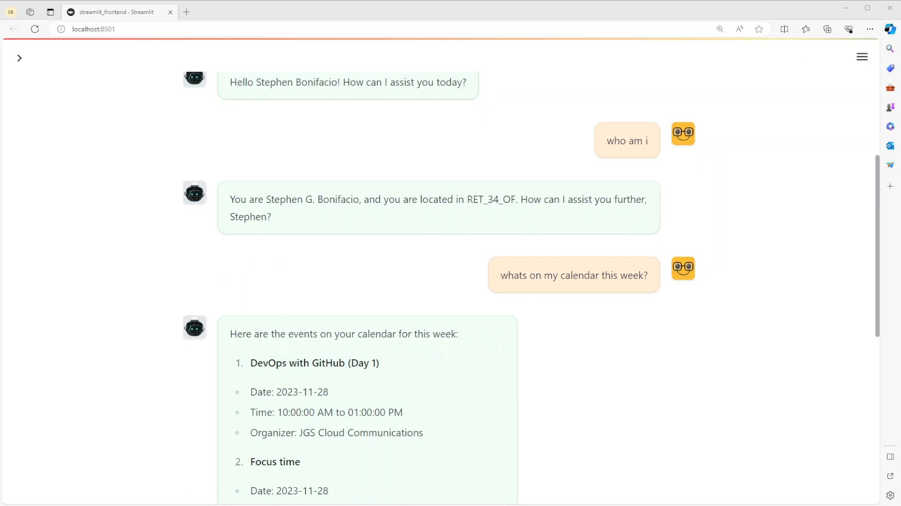

# Assistants API x Microsoft O365

## Description

`Assistants API x Microsoft O365` is a conversational assistant built using OpenAI's Assistants API that integrates with Microsoft Office 365 components (Outlook, Teams etc) via Microsoft Graph endpoints. 

## Assistant Tools

- **User Profile Retrieval**: Retrieves user information stored in O365. (.e.g. name, position, location)
- **Calendar Events Retrieval**: Retrieves events for the week from the user's O365 calendar.
- **Email Fetching**: Fetches flagged emails and emails with specific content from a sender.
- **Dynamic Email Replies**: Facilitates replying to emails directly through the assistant.

## Tech Stack

- Assistants API
- GPT-3.5-Turbo-1106
- Microsoft Graph https://learn.microsoft.com/en-us/graph/overview
- streamlit

## Installation

```bash
# Clone the repository
git clone <repository-url>

# Install dependencies
pip install -r requirements.txt

# Run the Streamlit frontend
cd streamlit_frontend
streamlit run streamlit_frontend.py
```

## Usage

1. Start the Streamlit application.
2. Interact with the chat interface by sending messages.
3. The application processes the message and provides a response or performs the requested action.

## Demo - click to watch the video

[](https://youtu.be/jnXWVUlkFhY)

## Roadmap

- add integrations with other O365 components - Teams, OneDrive, SharePoint etc

## Contributing

...is welcome! 🤗

## Developer Notes

- Placeholder

## Author


#### Stephen Bonifacio

Feel free to connect with me on:

Linkedin: https://www.linkedin.com/in/stephenbonifacio/  
Twitter: https://twitter.com/Stepanogil

Did you find this useful? If you'd like to show some love, I won't say no to a cup of coffee! 🤗

[](https://ko-fi.com/Q5Q6QPABZ)

